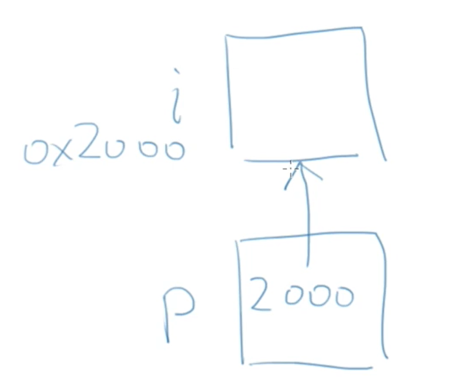
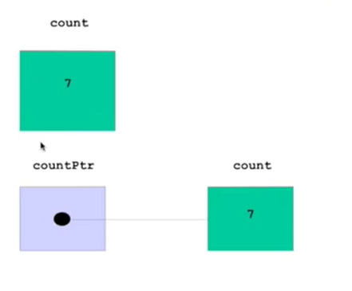

## 为什么是C语言? 

* 现代的编程语言在语法上差异很小
* 几乎都是C-like语言
* 语言的能力/适用的领域主要是由库和传统所决定的

## 编译-->运行

* C需要被编译才能运行，所以需要编辑器或者编译器或者IDE(集成开发环境)

## 程序框架

```C
#include <stdio.h>
int main()
{
    return 0;
}
```
## 算找零

* 有地方放输入的数字(变量)
* 有办法输入数字(外部输入)
* 输入的数字能参与计算

## 变量

* 变量定义的一般形式就是：
<类型名称><变量名称>;

## 赋值和初始化

int price=0;

```

<类型名称><变量名称>=<初始值>;

int price=0;

int amount=100;

int price=0,amount=100;

```
# 变量类型

int price=0;

C是是一种有类型的语言，所有的变量在使用之前必须定义
或声明，所有的变量必须具有确定的类型

## 读整数

```c
scanf("%d",&price);
```

# 常量

* int change =100-price;

* 固定不变的数，是常数。直接写在程序里，我们称作直接量(literal)。

* const int AMOUNT=100;

const是一个修饰符，加在int的前面，用来给这个变量
加上一个const(不变的)的属性、这个const的属性表示这个变量
的值一旦初始化，就不能再修改了。

## 数据类型

当浮点数和整数放到一起运算时，C会将整数转换成浮点数，然后进行浮点数的运算

浮点数类型：双精度浮点数(double)、单精度浮点数(float)

# 表达式
## 计算时间差

输入两个时间，每个时间分别输入小时和分钟的值，然后输出两个时间之间的差，也以几小时几分表示

>遇到问题的时候，首先需要思考如何读取数据、存储数据、如何计算

```C
int hour1,minute1;
int hour2,minute2;
```

## 赋值运算符

* a=b=6->a=(b=6)

>程序是按步骤执行的
程序表达的是顺序执行的动作，而不是关系
a=b;
b=a;
是依次执行的，结果使得a和b都得到b原来的值

## 递增递减运算符

* "++"和"--"可以放在变量的前面，叫做前缀形式，也可以放在变量的后面，叫做后缀形式。
* a++的值是a加1以前的值
* ++a的值是加了1以后的值
* 无论哪个，a自己的值都加了1了。

# 数组

```c
int number[cnt];
```


## 定义数组

```c
<类型>变量名称[元素数量]
int grades[100];
double weight[20];
元素数量必须是整数
C99之前:元素数量必须是编译时刻确定的字面量
```

* 是一种容器(用来放东西的)，特点是：
  * 其中所有的元素具有相同的数据类型；
  * 一旦创建，不能改变大小
  * 数组中的元素在内存中是连续依次排列的


* 一个int的数组
* 10个单元:a[0],a[1],...,a[9]
* 每个单元就是一个int类型的变量
* 可以出现在赋值的左边或者右边:
a[2]=a[1]+6;
* 在赋值左边的叫做左值

## 有效的下标范围

* 编译器和运行环境(IDE)都不会检查数组下标是否越界，无论是对数组单元作读还是写
* 一旦程序运行，越界的数组访问可能造成问题，导致程序崩溃
  * segmentation fault
* 但是也可能运气好，没造成严重的后果
* 所以这是程序员的责任来保证程序只使用有效的下标值:[0,数组的大小-1]

* int a[0];
* 可以存在，但是无用

# 函数

函数是一块代码，接收零个或者多个参数，做一件事情，并返回零个或一个值

# 指针

* 是一个运算符，给出某个类型或变量在内存中所占据的字节数
* sizeof(int)
* sizeof(i)

## 运算符&

* scanf("%d",&i);里的&
* 获得变量的地址，它的操作数必须是变量
* int i;printf("%x",&i);
* 地址的大小是否与int相同取决于编译器
* int i;printf("%p",&i);

### &不能取的地址

* &不能对没有地址的东西取地址
* &(a+b)?
* &(a++)?
* &(++a)?


```C
#include <stdio.h>
int main()
{
	int a[10];
	
	printf("%p\n",&a);
	printf("%p\n",a);
	printf("%p\n",&a[0]);
	printf("%p\n",&a[1]);
	 
    return 0;
}
000000000062FDF0
000000000062FDF0
000000000062FDF0
000000000062FDF4
```


## 指针

* 如果能够将取得的变量的地址传递给一个函数，能否通过这个地址在那个函数内访问这个变量?

* scanf("%d",&i);
* scanf()的原型应该是怎样的？我们需要一个参数能够保存别的变量的地址，如何表达能够保存地址的变量?

* 指针就是保存地址的变量

```C
int i;
int* p=&i;
int* p,q;#表示p是指针
int *p,q;#表示p是指针
```


## 指针变量

* 变量的值是内存地址
    * 普通变量的值是实际的值
    * 指针变量的值是具有实际值的变量的地址



## 作为参数的指针

* void f(int *p);
* 在被调用的时候得到了某个变量的地址;
    * int i=0;f(&i);
* 在函数里面可以通过这个指针访问外面的这个i
* int i;scanf("%d",i);
* 上面scanf误以为传入的i是地址，运行时一定会报错。

### 传入函数的数组成了什么?

### 以下四种函数原型是等价的:
    * int sum(int *ar,int n);
    * int sum(int *,int);
    * int sum(int ar[],int n);
    * int sum(int [],int);

### 数组变量是特殊的指针

* 数组变量本身表达地址，所以
    * int a[10];int *p=a;//无需用&取地址
    * 但是数组的单元表达的是变量，需要用&取地址
    * a==&a[0]
* []运算符可以对数组作，也可以对指针做:
    * p[0]<==>a[0]
* *运算符可以数组作，也可以对指针做:
    * *a=25;
* 数组变量是const的指针，所以不能被赋值
    * int a[]<==>int* const a=..

## 字符类型
* char是一种整数，也是一种特殊的类型：字符
    * 用单引号表示的字符字面量:'a','1'
    * "也是一个字符
    * printf和scanf里用%c来输入输出字符
* 一个字符加一个数字得到ASCII码表中那个数之后的字符
* 两个字符的减，得到它们在表中的距离

## 逃逸字符

* 用来表达无法印出来的控制字符或特殊字符，它由一个反斜杠"\"开头，后面跟上另一个字符，这两个字符合起来，组成了一个字符

* '\b'回退一格

# 字符数组

* char world[]={'H','e','l','l','o','!'};
